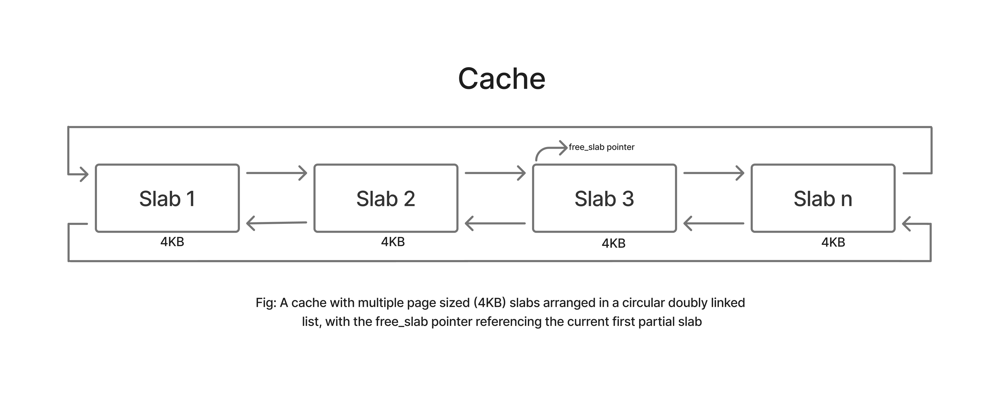
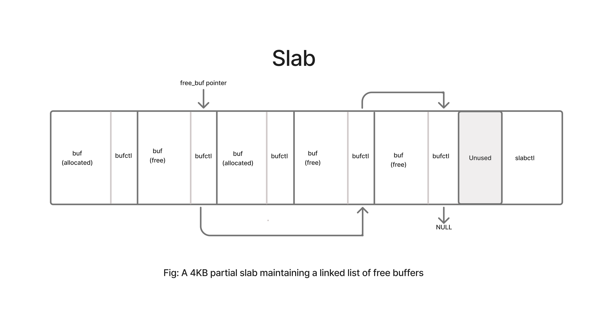

# objcache - Object Caching Slab Allocator

### Based on Jeff Bonwick's paper ***The Slab Allocator: An Object-Caching Kernel Memory Allocator*** [[pdf](https://people.eecs.berkeley.edu/~kubitron/courses/cs194-24-S14/hand-outs/bonwick_slab.pdf)]

## Overview 
I have been interested to write a memory allocator for some time and finally thought of writing the Slab Allocator as first introduced in the above paper by 
Jeff Bonwick. This is my basic attempt to implementing some of the very interesting ideas presented in the paper such as object caching for learning purpose. 
The allocator is written in the userspace for the userspace programs that has to frequently allocate and free many objects of same type.

Features/optimizations that are yet to be worked on which I will be writing over the next few weeks: 
* Optimize the `constructed` flag type in `objc_bufctl` struct by using a bit map
* Slab coloring
* Large object optimization and small object validations
* Memory reclamation 

## Design
A cache represents a collection of contiguous, page aligned memory blocks. 

Each of these page aligned blocks is called a slab.

## Documentation

Detail documentation regarding the implementation, uses, and architecture will be added soon. If you are curious, check out the original paper as this project
tries to implement many of the techniques described there.

## Benchmark and Analysis

To be added soon.
